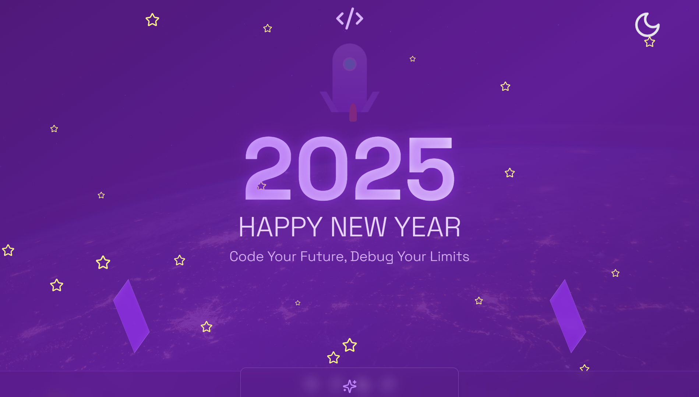

# New Year 2025 - Code Your Future 🚀

A futuristic New Year celebration website for developers, featuring stunning 3D animations, parallax effects, and motivational messages. Built with React, TypeScript, and Tailwind CSS.



## ✨ Features

- 🎆 Interactive 3D animations and effects
- 🚀 Animated 3D rocket launch sequence
- ⭐ Parallax star field background
- 🌟 Glowing orbs with random movements
- ⏰ Real-time countdown to 2025
- 💡 Developer-focused motivational messages
- 📱 Fully responsive design
- 🎨 Beautiful purple-themed color palette

## 🛠️ Technologies

- React 18
- TypeScript
- Tailwind CSS
- Vite
- Lucide Icons
- CSS Animations

## 🚀 Getting Started

1. Clone the repository:
```bash
git clone https://github.com/Sudhaanshuu/New-Year-2025.git
cd New-Year-2025
```

2. Install dependencies:
```bash
npm install
```

3. Start the development server:
```bash
npm run dev
```

4. Build for production:
```bash
npm run build
```

## 🎯 Project Structure

```
src/
├── components/         
│   ├── HeroSection/   
│   ├── CountdownTimer/
│   ├── ParallaxStars/ 
│   └── ...
├── styles/            
└── App.tsx           
```

## 🎨 Features Breakdown

### 3D Animations
- Custom-built 3D rocket with launch sequence
- Floating orbs with randomized movements
- Parallax star field effect

### Interactive Elements
- Real-time countdown to 2025
- Hover effects on resolution cards
- Smooth scroll animations

### Developer Focus
- Coding-themed motivational messages
- Developer resolutions for 2025
- Tech-inspired design elements

## 📱 Responsive Design

The website is fully responsive and optimized for:
- Desktop computers
- Tablets
- Mobile devices

## 🤝 Contributing

Contributions are welcome! Please feel free to submit a Pull Request.

## 📄 License

This project is licensed under the MIT License - see the [LICENSE](LICENSE) file for details.

## 🙏 Acknowledgments

- Space background image from Unsplash
- Icons from Lucide React
- Font: Space Grotesk from Google Fonts

## 🔗 Links

- [Live Demo](https://sukunewyear2025.netlify.app/)
- [GitHub Repository](https://github.com/Sudhaanshuu/New-Year-2025.git)

---

Made with 💜 by Sudhanshu, for Students.
